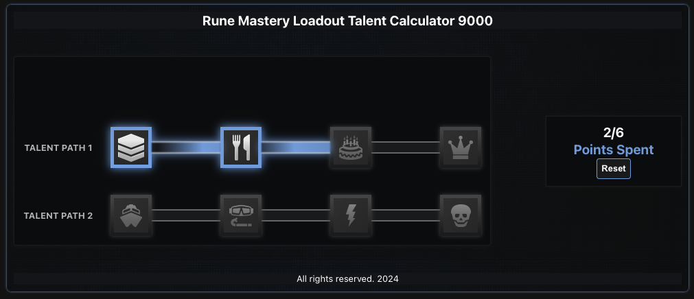
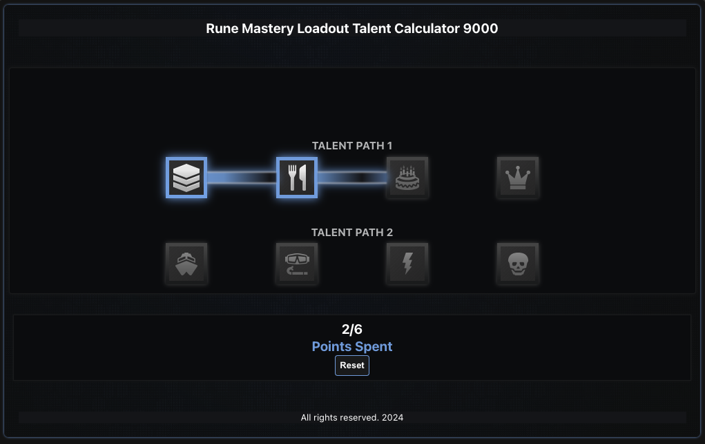

# Full-Stack Developer Challenge

In this repo you will find the solution to the “TitanStar Legends” Talent path mastery module.

### Tech stack used for this solution:

Some of the features implemented in this solution:

- Responsive UI/UX
- Ability to select 4 talents per Talent Path
- Ability to remove selected talents from the Paths
- A friendly indicator of points spent in selected talents
- Ability to handle the rendering of multiple talent paths (Initially setup with 2 paths described in the mockup)
- Session storage in case the tab is refreshed by accident, if a new tab is opened the paths will reset to a default value.
- Ability to reload the original paths state with a reset button (This will refetch data from the API)
- Small Node+Express Backend to simulate a real API interaction

## Installation Instructions

### Requirements to setup the project locally:

- A working Internet connection
- yarn package manager
- A web browser with Chromium 125+

### Project Setup:

The project has a simple mono repo structure, it contains 2 packages "dnd-frontend" and "dnd-backend"

In order to setup the project follow the steps:

- Clone the repository locally
- Navigate to the root folder <dnd-front-end-developer-challenge>
- Execute the command `yarn install` to install all dependencies in both packages for FE and BE
- Navigate to packages/frontend and create a `.env` file and add the environment variable `VITE_TALENTS_BACKEND_URL` (if ran locally the backend is configured to be `http://localhost:3000`)

Your .env should look like:

> VITE_TALENTS_BACKEND_URL=http://localhost:3000

### Running the Project:

- If all dependencies are installed correctly, to run the project locally you will need 2 consoles for both Backend and Frontend. Run the commands `yarn backend:dev` and `yarn frontend:dev`

## Rune Mastery Loadout Talent Calculator 9000

Players of TitanStar Legends can spend talent points that they’ve collected on runes within a tree.

#### How to play?

- Left click to add points.
- Right click to remove points.
- The user may only use up to 6 points.
- Each item only accounts for one point.
- Displays current point total
- The user must select the items in order.
  - For example: The user may not put a point in the cake without first having put points in the chevrons and the silverware (in that order).
- The app has a protection in case the user accidentally refreshes the tab and it saves the runes selection (temporarily or until the tab is closed)
- A reset button is available to clear the current selection and reload the original paths state

#### The UI is responsive and should be able to adapt to most modern devices.

#### Tablet View

#### Tablet View

#### Mobile View

